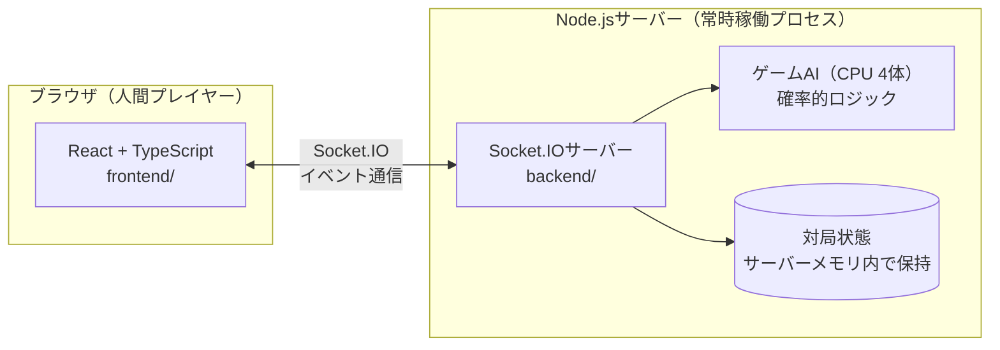
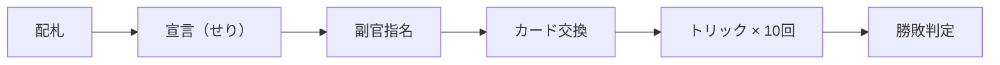

# napoleon-app

技育CAMP2026 ハッカソンVol.5（9/17〜10/3）向けのプロジェクト。
トランプゲーム「ナポレオン」を、人間1人 × AI（CPU）4体で遊べるWebアプリとして実装する。

> **「AI」の表記について**
> このドキュメントでいう「AI」は、機械学習モデル（LLM・強化学習等）を指すものではありません。
> 確率的な意思決定ロジック（ヒューリスティック）に基づくゲームAI（チェスエンジンや将棋ソフトの探索ロジックと同じ分類）を指します。
> 対局中のCPU 4体の思考ルーチンがこれにあたり、学習や推論APIは使用しません。

> **Web版とスマホアプリ版について**
> ハッカソンMVPではWebアプリ（React）のみを実装する。スマホアプリのネイティブ実装は行わない。
> ただし「招待しないと始まらない」というURL共有前提の成長戦略上、Web版は今後も低摩擦な入口として残り続ける想定で、スマホアプリ化は継続開発フェーズでの追加（ゴッドフィールドのように、Web版とアプリ版が並行して存在する形に近い）として位置づけている。今のReact実装は、PWA化・Capacitor等でのネイティブラップに転用できる想定で設計している。

## このアプリの特徴

ナポレオンは、宣言（せり）のせり上げ・隠れ副官による駆け引き・役札の特殊な強さといった、麻雀に匹敵する戦略性を持つトランプゲーム。中でもこのアプリが主役に据えるのは「副官が誰か分からないまま探り合う」People Fun（社会的つながりの面白さ）。麻雀を雀魂が初心者向けに広げたのと同じように、ルールを知らない人でも3分のチュートリアルで1局遊べる体験を入り口にする。

## アーキテクチャ



サーバー権威型の設計。手札・役割などクライアントに見せてはいけない情報はサーバー側だけが保持し、DBは使わずサーバーのメモリ内でゲーム状態を管理する（1対局＝1セッションで完結するMVPのため）。

## ゲームフェーズの流れ



## 技術スタック（決定事項）

| レイヤー | 選択 |
|---|---|
| フロントエンド | React（TypeScript） |
| バックエンド | Node.js（TypeScript）＋ Socket.IO |
| DB | なし（サーバーメモリ内で状態管理。MVPスコープでは永続化不要と判断） |

選定理由・比較検討の経緯は要件定義書（Claude Docs）の「意思決定の経緯（ADR）」セクション参照。

- **フロントエンド**：Flutter（Dart）を複数回検討したが、最終的にWeb（React）へ変更。理由は① Flutter実装経験ありという前提が誤認だったこと、② Flutterはこのジャンル（隠れ情報のリアルタイムゲーム）の実装事例が少ないこと、③ 何よりバックエンド（Node.js）と言語を統一し、9/28-30のHayato不在期間も4人が互いのコードを読み合える体制を優先したこと
- **バックエンド**：Firebase Cloud Functionsを検討したが、個人開発規模では「Web＋Node.js＋WebSocket」が先行事例の多数派という調査結果に合わせてNode.js／Socket.IOへ変更
- **DB**：Firestoreを検討したが、Node.js（常時稼働プロセス）採用によりステートレス制約が無くなったため、外部DB不要（サーバーメモリ内保持）の当初方針に回帰

## MVPスコープ早見表

人間1人 × AI4体、フルランダムなせりで役割が決まる、ナポレオンのコアルールが完全に動くWebアプリを作る。それ以上は継続開発フェーズに送る。

**実現するもの:**
- コアルール全フェーズ／役札3種＋ジョーカー＋よろめき
- AI4体（ナポレオン役も含めフルランダムに自律対応）
- 各フェーズ専用UI＋チュートリアル＋リザルト画面
- ゲーム開始からチュートリアル・本番対局までの導線

**やらないもの:**
- 友人内リアルタイムマルチプレイ
- アカウント・戦績・ルーム機能
- CPU難易度選択（5人以外の人数バリエーションも対応しない）

## 機能要件定義書

FR-01〜FR-77 の全機能要件、優先度（Must/Should/Could）、担当区分、マイルストーンとの紐付けは以下を参照：

- [ナポレオン MVP 機能要件定義（Claude Docs）](https://claude.ai/code/artifact/052e8022-7794-41db-8eda-b85ef5af62f1)

## ディレクトリ構成

```
napoleon-app/
├── frontend/          # React + TypeScript（Vite）
│   └── src/
│       ├── App.tsx    # ルートコンポーネント
│       └── main.tsx   # エントリーポイント
├── backend/           # Node.js + TypeScript + Socket.IO
│   └── src/
│       └── index.ts   # Socket.IOサーバー起動処理
└── .github/workflows/
    └── ci.yml         # lint・型チェック・build・ユニットテストの自動実行
```

## セットアップ

```bash
# backend（デフォルト: http://localhost:3001）
cd backend
npm install
npm run dev

# frontend（デフォルト: http://localhost:5173）
cd frontend
npm install
npm run dev
```

両方を起動した状態でfrontendにアクセスすると、Socket.IO経由でbackendからのイベントを受信できることを画面上で確認できる（疎通確認用の最小UI）。

## 開発ルール（QA方針）

未経験メンバーが多い体制のため、文書ベースのQAルールに頼らず、仕組み（GitHub Actions・ブランチ保護）で品質を担保する方針。

- `main` への直push禁止。必ずPull Requestを経由する
- PRのマージには1件以上のレビュー承認が必須（ブランチ保護ルール、設定済み）
- GitHub Actions（`.github/workflows/ci.yml`）でPR作成時に以下を自動実行

| チェック内容 | 何を検出するか |
|---|---|
| Lint（ESLint / oxlint） | 構文ミス・スタイル不統一 |
| 型チェック（`tsc --noEmit`） | TypeScriptの型不整合 |
| ビルド確認（`npm run build`） | そもそもビルドが通るか |
| ユニットテスト | ルールエンジンの純粋関数（宣言の強さ比較、カードの強さ判定、勝敗判定など）のみが対象。UIやアニメーションはテスト対象外 |

## マイルストーン（仮）

| マイルストーン | 期間 | 関連FR |
|---|---|---|
| M0：環境構築・疎通確認・叩き台決定 | 9/21夜〜9/22朝 | FR-72（叩き台） |
| M1：ルールエンジン構築 | 9/22〜9/23 | FR-01〜28 |
| M2：AI実装＋UI雛形＋チュートリアル素材 | 9/24〜9/25 | FR-29〜34, 71, FR-35〜44, 65, 66, FR-74〜77 |
| M3：統合（最重要チェックポイント） | 9/26〜9/27 | FR-45〜49, FR-72, 73 |
| M4：磨き込み（Hayato不在期間） | 9/28〜9/30 | FR-57〜64, FR-44, 65, 66 |
| M5：最終統合チェック | 10/1 | FR-50〜56, FR-61 |
| M6：デモ準備 | 10/2〜10/3 | - |

**この順番には依存関係がある。** 優先度（Must/Should/Could）だけを見て着手順を決めると、後工程のタスクに先に手をつけて詰まることがあるため、必ずMilestone順を守る。

1. **M1** — ルールエンジンをUI無しで動く状態にする（土台）
2. **M2** — M1の上にAI・UI・チュートリアルを**並行**で乗せる
3. **M3** — M1・M2の成果物を**つなぎ込み**、1局通しでプレイできる状態にする
4. **M4** — 異常系対応や演出強化など、**M3の土台の上に乗るタスク**を消化する（M3未完了のまま着手不可）
5. **M5** — 通しプレイの最終確認・残タスクの棚卸し

例えば異常系（FR-57〜64）はMustだが、対局が通しでプレイできる状態（M3）ができてからでないと着手しようがないため、M4に配置されている。

詳細は要件定義書の「マイルストーン（仮）」セクション参照。

## 今回やらないこと（明文化）

- ノートランプ宣言（FR-08）
- 複数ラウンドの得点累積・スコアリング（FR-28）
- 友人内リアルタイムマルチプレイ（副官の隠し情報を複数端末間で同期する通信設計）は継続開発フェーズに回す
- 4人・6人などの人数バリエーション対応（5人固定）

詳細・オープン論点は要件定義書参照。まだチーム内で結論が出ていない主な論点：
- チュートリアル演出の対象範囲（Coreルールのみ説明するか、Should以上も説明するか）
- 配色・見た目の方向性（基調色など）

決定済みだが背景を残しておきたい論点：
- 人間プレイヤーの座席：固定案ではなくフルランダム案を採用（せり合いの緊張感という面白さの核を優先）
- 宣言の最低枚数（FR-07）：11枚（5人プレイ）で確定

## 開発の進め方（初心者向け）

Gitに不慣れな人向けの、変更を1つ実装してマージするまでの手順。分からなくなったら、このセクションに戻ってきてください。

### 1. 最新のmainを取得する

```bash
git switch main
git pull origin main
```

### 2. 作業用ブランチを作る

```bash
git branch <種類>/<内容が分かる短い英語>
git switch <種類>/<内容が分かる短い英語>
```

`<種類>`は以下から選ぶ：

| 種類 | 使うとき |
|---|---|
| `feat/` | 新機能を追加するとき |
| `fix/` | バグを直すとき |
| `docs/` | ドキュメントだけ直すとき |
| `refactor/` | 動きを変えずにコードを整理するとき |

例：`git branch feat/fr-13-fukukan-shimei` → `git switch feat/fr-13-fukukan-shimei`（FR-13 副官指名の実装）

### 3. コードを書いて、コミットする

```bash
git add <変更したファイル>
git commit -m "feat: FR-13 副官指名の実装"
```

コミットメッセージは `feat:` `fix:` `refactor:` `docs:` のプレフィックス必須（[CLAUDE.md](../CLAUDE.md)のルール）。対応するFR番号があれば必ず含める。

### 4. pushする

```bash
git push -u origin <ブランチ名>
```

### 5. Pull Requestを作る

GitHubのリポジトリページを開くと、さっきpushしたブランチについて「Compare & pull request」という黄色いボタンが出るので、それを押す。

- タイトルにFR番号を含める（例：`feat: FR-13 副官指名の実装`）
- 本文には「何をしたか」「なぜそうしたか」を軽く書く
- 「Create pull request」ボタンを押して完了

コマンドに慣れてきたら `gh pr create` でも同じことができるが、最初はGUIで操作を覚えるのがおすすめ。

### 6. CIが通るのを待つ

PRを作るとGitHub Actionsが自動でLint・型チェック・ビルド・テストを実行する（数十秒〜1分程度）。赤い✗が出たら、そのログを見て直してから再度push。

### 7. レビュー依頼する

PR画面右側の「Reviewers」から、チームメンバーを最低1人指名する。**レビュー承認が1件つかないとマージできない設定になっている**（ブランチ保護ルール）。

### 8. レビューで指摘が来たら

指摘箇所を直して、同じブランチにコミット＆pushするだけでよい（PRは自動的に更新される）。直したら、コメントで「直しました」と一言添えると親切。

### 9. マージする

レビューが承認され、CIも通ったら、PR画面の「Squash and merge」ボタンでマージする（コミット履歴が1つにまとまって見やすくなるため、Squashを推奨）。マージ後、ブランチは削除してOK（画面上のボタンで消せる）。

## レビューのやり方（レビュアー側）

レビューは「間違い探し」ではなく「一緒にコードを理解する作業」。分からないところを素直に聞くのが一番価値のあるレビューになる。

### 見る順番

1. **PRの説明を読む**：「何をしたいPRか」を先に頭に入れる
2. **CIが緑か確認**：赤いままなら中身を見る前にそれを指摘するだけでOK
3. **「Files changed」タブで差分を読む**：追加された行（緑）と削除された行（赤）が中心
4. **説明と差分が一致しているか確認**：関係なさそうな変更が紛れ込んでいないか

### コメントするときのコツ

- **分からない箇所は「ここ何してるんですか？」でいい**：初心者チームなので、素朴な質問こそ大事。むしろ書いた本人の説明不足に気づけることが多い
- **直してほしい箇所は具体的に**：「ここ変じゃない？」より「◯◯の場合にエラーになりそうです」の方が直しやすい
- **良いと思った箇所も褒める**：ダメ出しだけだと消耗する

### Approveのやり方

「Files changed」タブ右上の「Review changes」ボタン→コメントを書いて「Approve」を選択→送信。明らかな問題がなければ、多少の好みの違いはApproveしてOK（完璧を求めすぎない）。

## Gitコマンド早見表

| やりたいこと | コマンド |
|---|---|
| 最新のmainに切り替える | `git switch main` |
| リモートの変更を取り込む | `git pull origin main` |
| 新しいブランチを作る | `git branch <ブランチ名>` |
| ブランチを切り替える | `git switch <ブランチ名>` |
| 変更をステージする | `git add <ファイル名>` |
| コミットする | `git commit -m "<メッセージ>"` |
| 初回push（以降は`git push`だけでOK） | `git push -u origin <ブランチ名>` |
| 今の状態を確認する | `git status` |

PR作成・レビュー・マージはGitHubのWeb画面から行うのが基本。CLIに慣れてきたら`gh pr create`や`gh pr checks <PR番号>`も使える。
