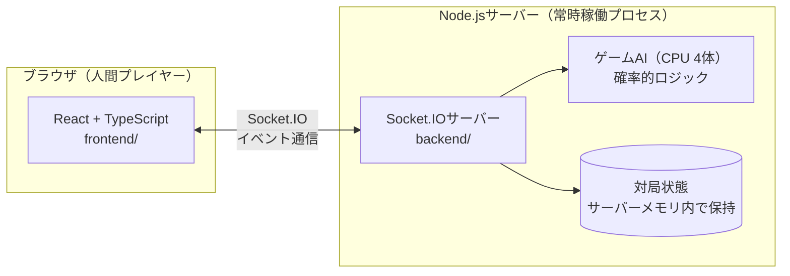
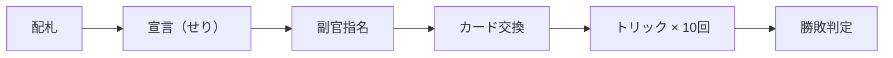

# napoleon-app

技育CAMP2026 ハッカソンVol.5（9/17〜10/3）向けのプロジェクト。
トランプゲーム「ナポレオン」を、人間1人 × AI（CPU）4体で遊べるWebアプリとして実装する。

> **「AI」の表記について**
> このドキュメントでいう「AI」は、機械学習モデル（LLM・強化学習等）を指すものではありません。
> 確率的な意思決定ロジック（ヒューリスティック）に基づくゲームAI（チェスエンジンや将棋ソフトの探索ロジックと同じ分類）を指します。
> 対局中のCPU 4体の思考ルーチンがこれにあたり、学習や推論APIは使用しません。

## このアプリの特徴

ナポレオンは、宣言（せり）のせり上げ・隠れ副官による駆け引き・役札の特殊な強さといった、麻雀に匹敵する戦略性を持つトランプゲーム。中でもこのアプリが主役に据えるのは「副官が誰か分からないまま探り合う」People Fun（社会的つながりの面白さ）。麻雀を雀魂が初心者向けに広げたのと同じように、ルールを知らない人でも3分のチュートリアルで1局遊べる体験を入り口にする。

## アーキテクチャ



サーバー権威型の設計。手札・役割などクライアントに見せてはいけない情報はサーバー側だけが保持し、DBは使わずサーバーのメモリ内でゲーム状態を管理する（1対局＝1セッションで完結するMVPのため）。

## ゲームフェーズの流れ



## 技術スタック（決定事項）

| レイヤー | 選択 |
|---|---|
| フロントエンド | React（TypeScript） |
| バックエンド | Node.js（TypeScript）＋ Socket.IO |
| DB | なし（サーバーメモリ内で状態管理。MVPスコープでは永続化不要と判断） |

選定理由・比較検討の経緯は要件定義書（Claude Docs）の「意思決定の経緯（ADR）」セクション参照。

## MVPスコープ早見表

人間1人 × AI4体、フルランダムなせりで役割が決まる、ナポレオンのコアルールが完全に動くWebアプリを作る。それ以上は継続開発フェーズに送る。

**実現するもの:**
- コアルール全フェーズ／役札3種＋ジョーカー＋よろめき
- AI4体（ナポレオン役も含めフルランダムに自律対応）
- 各フェーズ専用UI＋チュートリアル＋リザルト画面
- ゲーム開始からチュートリアル・本番対局までの導線

**やらないもの:**
- 友人内リアルタイムマルチプレイ
- アカウント・戦績・ルーム機能
- CPU難易度選択（5人以外の人数バリエーションも対応しない）

## 機能要件定義書

FR-01〜FR-77 の全機能要件、優先度（Must/Should/Could）、担当区分、マイルストーンとの紐付けは以下を参照：

- [ナポレオン MVP 機能要件定義（Claude Docs）](https://claude.ai/code/artifact/052e8022-7794-41db-8eda-b85ef5af62f1)

## ディレクトリ構成

```
napoleon-app/
├── frontend/          # React + TypeScript（Vite）
│   └── src/
│       ├── App.tsx    # ルートコンポーネント
│       └── main.tsx   # エントリーポイント
├── backend/           # Node.js + TypeScript + Socket.IO
│   └── src/
│       └── index.ts   # Socket.IOサーバー起動処理
└── .github/workflows/
    └── ci.yml         # lint・型チェック・build・ユニットテストの自動実行
```

## セットアップ

```bash
# backend（デフォルト: http://localhost:3001）
cd backend
npm install
npm run dev

# frontend（デフォルト: http://localhost:5173）
cd frontend
npm install
npm run dev
```

両方を起動した状態でfrontendにアクセスすると、Socket.IO経由でbackendからのイベントを受信できることを画面上で確認できる（疎通確認用の最小UI）。

## 開発ルール（QA方針）

未経験メンバーが多い体制のため、文書ベースのQAルールに頼らず、仕組み（GitHub Actions・ブランチ保護）で品質を担保する方針。

- `main` への直push禁止。必ずPull Requestを経由する
- PRのマージには1件以上のレビュー承認が必須（ブランチ保護ルール、設定済み）
- GitHub Actions（`.github/workflows/ci.yml`）でPR作成時に以下を自動実行

| チェック内容 | 何を検出するか |
|---|---|
| Lint（ESLint / oxlint） | 構文ミス・スタイル不統一 |
| 型チェック（`tsc --noEmit`） | TypeScriptの型不整合 |
| ビルド確認（`npm run build`） | そもそもビルドが通るか |
| ユニットテスト | ルールエンジンの純粋関数（宣言の強さ比較、カードの強さ判定、勝敗判定など）のみが対象。UIやアニメーションはテスト対象外 |

## マイルストーン（仮）

| マイルストーン | 期間 | 関連FR |
|---|---|---|
| M0：環境構築・疎通確認・叩き台決定 | 9/21夜〜9/22朝 | FR-72（叩き台） |
| M1：ルールエンジン構築 | 9/22〜9/23 | FR-01〜28, FR-74〜77 |
| M2：AI実装＋UI雛形＋チュートリアル素材 | 9/24〜9/25 | FR-29〜34, 71, FR-35〜44, 65, 66, FR-74〜77 |
| M3：統合（最重要チェックポイント） | 9/26〜9/27 | FR-45〜49, FR-72, 73 |
| M4：磨き込み（Hayato不在期間） | 9/28〜9/30 | FR-57〜64, FR-44, 65, 66 |
| M5：最終統合チェック | 10/1 | FR-50〜56, FR-61 |
| M6：デモ準備 | 10/2〜10/3 | - |

詳細は要件定義書の「マイルストーン（仮）」セクション参照。

## 今回やらないこと（明文化）

- ノートランプ宣言（FR-08）
- 複数ラウンドの得点累積・スコアリング（FR-28）
- 友人内リアルタイムマルチプレイ（副官の隠し情報を複数端末間で同期する通信設計）は継続開発フェーズに回す
- 4人・6人などの人数バリエーション対応（5人固定）

詳細・オープン論点は要件定義書参照。
